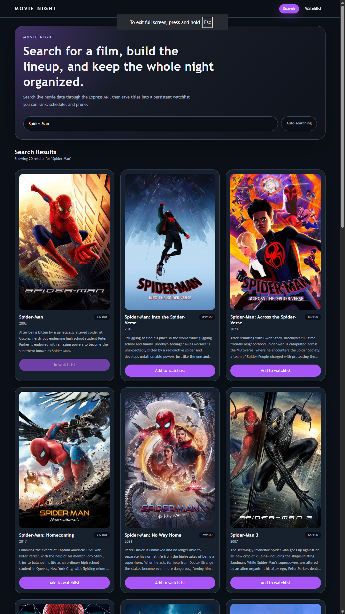
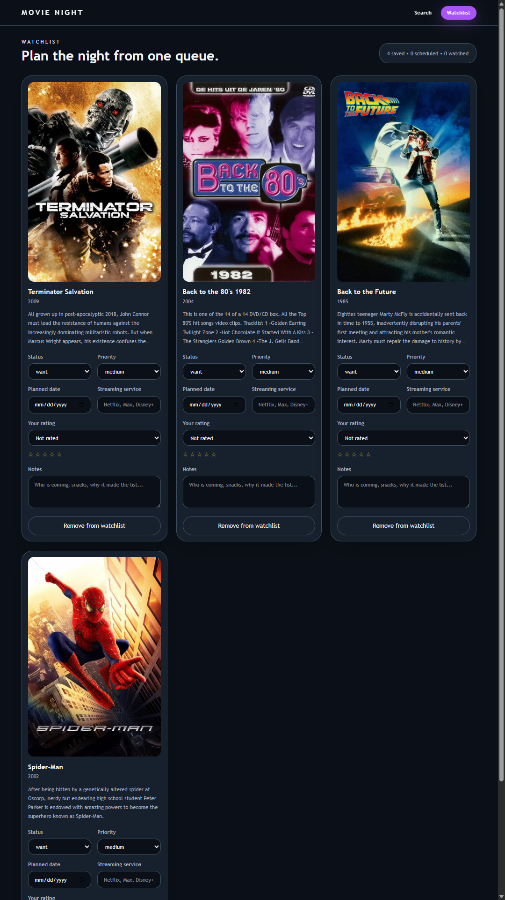
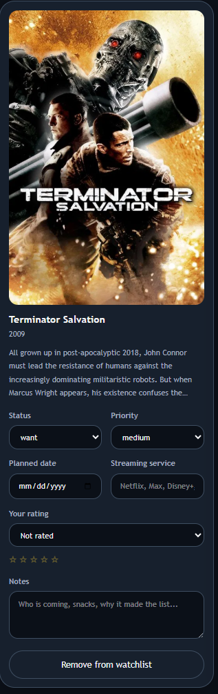

# Movie Night Planner

A full-stack movie planning app built with React, TypeScript, Express, and Supabase. It combines live movie search with a persistent watchlist so a group can search titles, compare options, and track the plan for the night in one interface.

## Why This Project

This project was built to demonstrate practical full-stack application work:

- React client with routed views and reusable UI components
- Express API layer that isolates third-party movie search from the frontend
- Supabase persistence for watchlist and planning metadata
- Form validation, error handling, and test coverage for core behavior
- Vercel-ready deployment with the Express API exposed through a serverless route

## Features

- Search movies through the backend API
- Save titles to a persistent watchlist
- Update watch status, priority, planned date, rating, streaming source, and notes
- Remove titles when plans change
- Preserve planner state between sessions with Supabase

## Stack

- React 19
- TypeScript
- Vite
- Tailwind CSS 4
- React Router 7
- Express
- Supabase
- Vitest
- ESLint
- Vercel

## Architecture

- `src/`: React frontend, routes, components, and API helpers
- `server/`: Express app, validation, TMDB provider integration, and Supabase store
- `api/[...route].js`: Vercel function entry point that runs the Express app
- `supabase/schema.sql`: SQL schema for the watchlist table
- Frontend requests to `/api` are proxied to the Express server during development

## Demo Views

### Search Experience

Shows the live movie search flow and result cards coming back through the Express API.



### Watchlist Planner

Shows the saved lineup with persistent planning fields like status, priority, and scheduled date.



### Movie Card Detail

Highlights the editable card controls for notes, rating, streaming source, and planning details.



## Running Locally

Install dependencies:

```bash
npm install
```

Create a local environment file:

Copy `.env.example` to `.env`.

Start the frontend:

```bash
npm run dev
```

Start the backend in a second terminal:

```bash
npm run server
```

The Vite frontend runs on `http://localhost:5173` by default and proxies API requests to the Express server on `http://localhost:5174`.

## Environment

A starter file is included at [.env.example](c:/Users/DSU%20Student/OneDrive%20-%20Dakota%20State%20University/Spring%202026%20Classes/React%20Reasearch%20Projects/react-movie-night-planner/.env.example).

- `PORT`: Express port for local development
- `CLIENT_ORIGIN`: allowed frontend origin for CORS
- `MOVIE_PROVIDER`: current provider, defaults to `tmdb`
- `MOVIE_SEARCH_URL`: provider endpoint override
- `MOVIE_IMAGE_BASE_URL`: TMDB image base URL
- `TMDB_API_TOKEN`: TMDB v4 Bearer token used for movie search
- `SUPABASE_URL`: Supabase project URL
- `SUPABASE_SERVICE_ROLE_KEY`: server-side Supabase key used by Express
- `SUPABASE_WATCHLIST_TABLE`: watchlist table name, defaults to `watchlist_items`

## Supabase Setup

1. Create a Supabase project.
2. Open the SQL editor in Supabase.
3. Run the SQL in [supabase/schema.sql](c:/Users/DSU%20Student/OneDrive%20-%20Dakota%20State%20University/Spring%202026%20Classes/React%20Reasearch%20Projects/react-movie-night-planner/supabase/schema.sql).
4. Copy `.env.example` to `.env`.
5. Fill in `SUPABASE_URL`, `SUPABASE_SERVICE_ROLE_KEY`, and `TMDB_API_TOKEN`.
6. Start the backend with `npm run server`.

## Vercel Deployment

1. Push the repository to GitHub.
2. Import the project into Vercel.
3. Set these environment variables in Vercel:
   `CLIENT_ORIGIN`
   `MOVIE_PROVIDER`
   `MOVIE_SEARCH_URL`
   `MOVIE_IMAGE_BASE_URL`
   `TMDB_API_TOKEN`
   `SUPABASE_URL`
   `SUPABASE_SERVICE_ROLE_KEY`
   `SUPABASE_WATCHLIST_TABLE`
4. Deploy.

Vercel builds the frontend from `dist/` and serves the Express API through [api/[...route].js](c:/Users/DSU%20Student/OneDrive%20-%20Dakota%20State%20University/Spring%202026%20Classes/React%20Reasearch%20Projects/react-movie-night-planner/api/%5B...route%5D.js).

## Validation

```bash
npm run lint
npm run typecheck
npm test
npm run build
```

## Portfolio Notes

This project is designed to show end-to-end product thinking, not just isolated UI work. The frontend handles search, routing, and planner interactions, while the backend owns provider integration, validation, persistence, and API behavior.

## Future Improvements

- Add authentication and per-user watchlists instead of a single shared dataset
- Support drag-and-drop prioritization and smarter scheduling suggestions
- Add optimistic UI updates with toast feedback for create, update, and delete actions
- Expand test coverage to include component-level interaction tests
- Add a public demo dataset or seeded onboarding flow for first-time visitors
